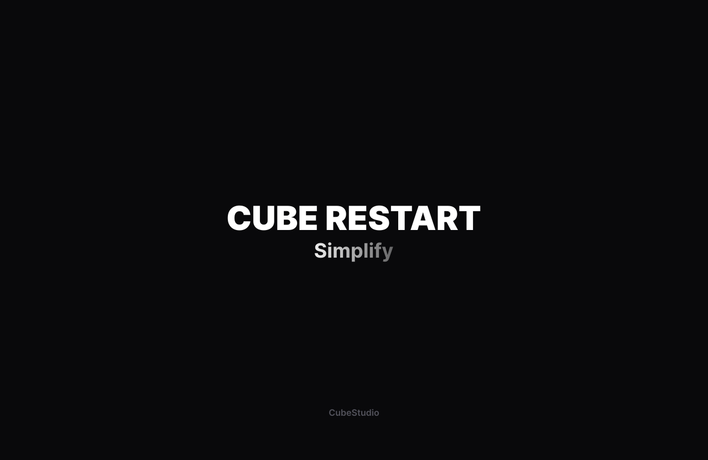

<h1 align="center">
  
  Cube Restart
  <br/>
</h1>

<p align="center">
    Твой помощник в игре на серверах проекта CubeShield. Работает в связке с Cube-API
</p>


## Стек


## Дорожная карта Cube-Restart

* [X] Первый запуск приложения
* [X] Обновление, удаление, загрузка модов, конфигов и тд
* [X] Возможность добавления сторонних модов в сборку путем основной папки ```mods```
* [X] Создание ```.exe``` файла приложения
* [X] Кроссплатформенность (Windows, Linux, MacOS)
* [X] Создание удобного хука для интеграции с лаунчерами
* [ ] Автозагрузка готовых профилей в разные лаунчеры (Minecraft Launcher, MultiMC, PrismLauncher, Modrinth App, CurseForge Launcher, TLauncher Legacy)
* [ ] Модульность сборок (управление независимыми компонентами и модернизация сборки)

## Использование

### Хук

Одним из способов использование CubeRestart является его интеграция с лаунчером, для этого вам небходимо установить само приложение на ваш ПК, после чего перезапустите ваш лаунчер, если он был запущен до установки приложения, создайте необходимую сборку, откройте ее настройки и выберите использование **хуков/пользовательских команд**. После чего в поле перед запуском введите команду:

```bash
cuberestart
```

Готово! Вы можете запускать сборку, при ее запуске программа сама будет подготавливать ее, устанавливать весь необходимый контент


## Полезные ссылки

* Телеграм-канал CubeStudio: https://t.me/+Gphg_BIJEdMwMmFi
* Сайт CubeStudio: [fadegor05.github.io/CubeStudio/](https://fadegor05.github.io/CubeStudio/)
* CubeStart: https://github.com/fadegor05/CubeStart


###### Not an official Minecraft product. We are in no way affiliated with or endorsed by Mojang Synergies AB, Microsoft Corporation or other rightsholders.
